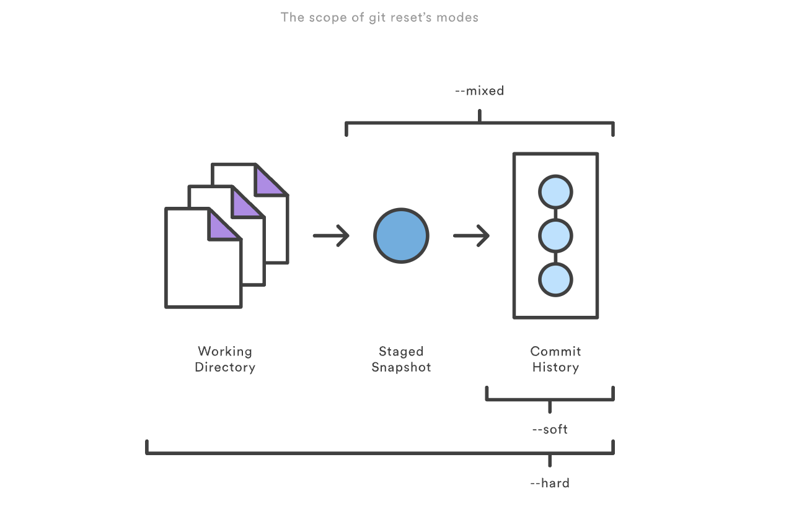
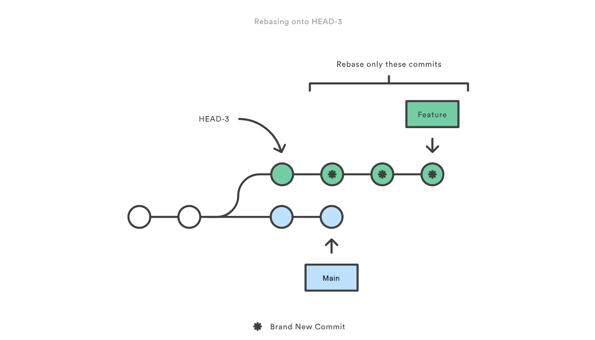

-
- Git Reset  Checkout  and Revert
	- [DOCUEMNT](https://www.atlassian.com/git/tutorials/resetting-checking-out-and-reverting)
	- Reset
	- 
	-
	- Checkout
	- Revert
-
- Git Branch
	- id:: 65be34ce-4b43-4cac-839f-1b2d425138b2
	  ```shell
	  # list branches
	  git branch # or  git branch --list
	  
	  # list remote branched
	  git branch -a
	  
	  
	  # create a new branch
	  git branch <new_branch>
	  # create new branch and switch to it
	  git checkout -b <new_branch>
	  # Create new branch base on esixting branch
	  git checkout -b <new_branch> <existing branch>
	  # Switch branch
	  git checkout <other_branch>
	  
	  
	  # delete a branch
	  git branch -d <branch>
	  
	  # reanme branch
	  git branch -m <branch>
	  # fetch remote branch
	  git fetch --all
	  # switch to remote branch
	  git checkout  <remotebranch>
	  
	  # push to remote branch
	  git push -u origin <branch>  # for first time
	  
	  ```
-
- Git Rebase
	- rebase feature commit onto main branch
	- ```shell
	  # rebase feature commit onto main branch
	  git checkout feature
	  git rebase -i main
	  
	  # p, pick = use commit
	  # r, reword = use commit, but edit the commit message
	  # e, edit = use commit, but stop for amending
	  # s, squash = use commit, but meld into previous commit
	  # f, fixup = like "squash", but discard this commit's log message
	  # x, exec = run command (the rest of the line) using shell
	  # d, drop = remove commit
	  ```
	- local cleanup
	- ```shell
	  # re-write feature branch commit
	  git checkout feature git rebase -i HEAD~3
	  
	  # OR re-write the entire feature branch
	  git merge-base feature main
	  ```
	- 
	-
-